# Практика 1

---

## Задание 1

Вывести имена всех пользователей из `/etc/passwd` в алфавитном порядке.

**План:** перейти в `/etc` - отбросить строки-комментарии - взять первое поле - отсортировать.

```bash
cd /etc
grep -v '^#' passwd | cut -d: -f1 | sort
```

`grep -v '^#'` убирает комментарии, `cut -d: -f1` берёт первый столбец (разделитель `:`), `sort` сортирует.

**Вывод:**

```
_apt
backup
balkat7
bin
daemon
dhcpcd
games
irc
landscape
list
lp
mail
man
messagebus
news
nobody
polkitd
proxy
root
sync
sys
syslog
systemd-network
systemd-resolve
systemd-timesync
uucp
uuidd
www-data
```

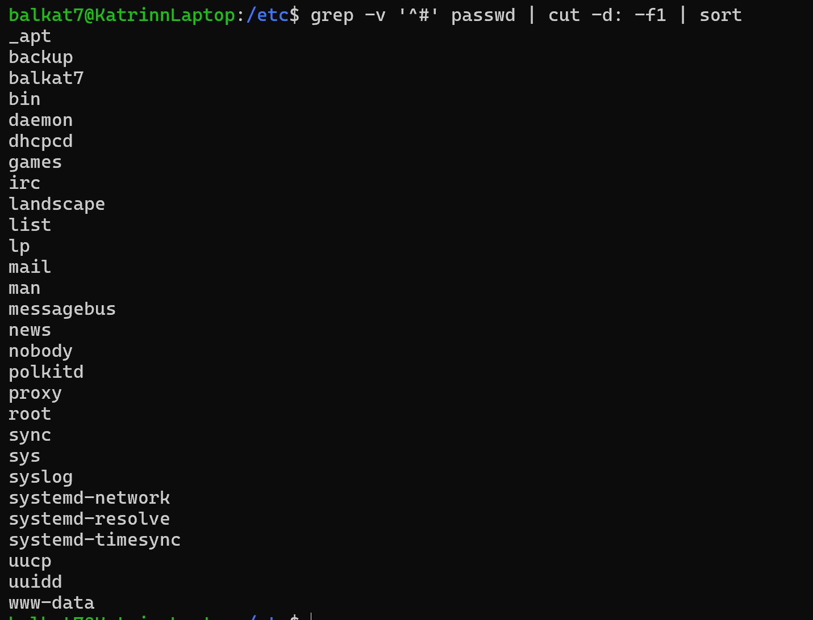

---

## Задание 2

Вывести 5 протоколов с наибольшими номерами из `/etc/protocols`.

**План:** отбросить комментарии - взять номер и имя - отсортировать по числу по убыванию - взять первые 5.

```bash
cd /etc
grep -E '^[^:]' protocols | awk '{print $2, $3}' | sort -nr | head -n 5
```

`awk '{print $2, $3}'` печатает второй и третий столбцы, `sort -nr` сортирует как числа по убыванию, `head -n 5` оставляет пять строк.

**Вывод:**

```
262 MPTCP
143 Ethernet
142 ROHC
141 WESP
140 Shim6
```

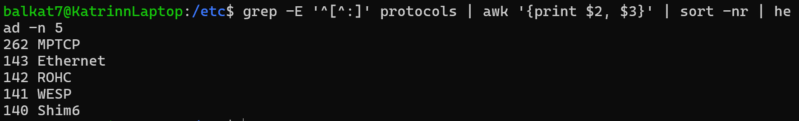

---

## Задание 3

Программа `banner`, выводящая переданный текст в рамке.

**План:** посчитать ширину текста - напечатать верхнюю рамку в цикле - текст - нижнюю рамку.

```bash
nano banner
```

```bash
#!/bin/bash

text="$*"
width=$((${#text} + 2))

printf "+"
for ((i=0; i<width; i++))
do
    printf "-"
done
printf "+\n"

printf "| %s |\n" "$text"

printf "+"
for ((i=0; i<width; i++))
do
    printf "-"
done
printf "+\n"
```

`$*` — все аргументы, `${#text}` — длина строки, плюс 2 пробела по краям.

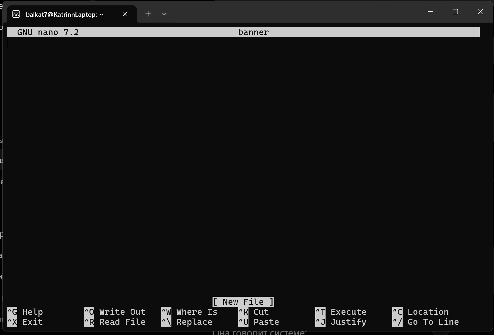

Запуск:

```bash
chmod +x banner
./banner "Hello from RTU MIREA!"
```

**Вывод:**

```
+-----------------------+
| Hello from RTU MIREA! |
+-----------------------+
```

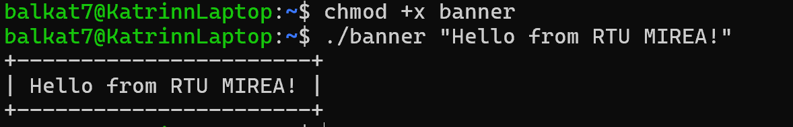

Проверка на кириллице:

```bash
./banner "Поставьте максимальный балл)"
```

```
+------------------------------+
| Поставьте максимальный балл) |
+------------------------------+
```

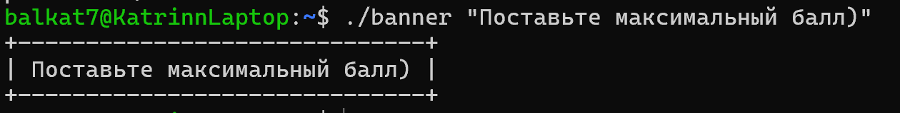

Содержимое готового файла (`cat banner`):

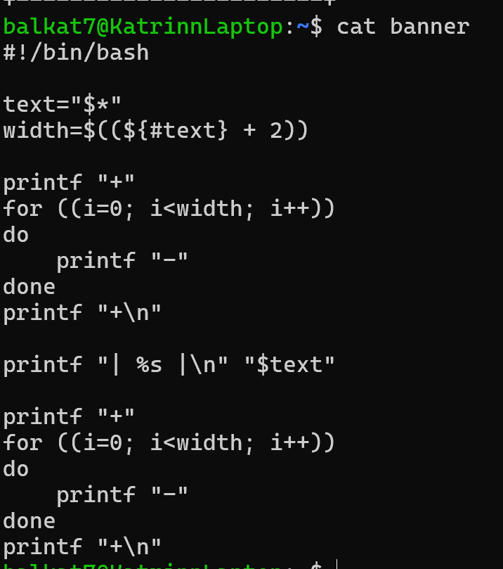

---

## Задание 4

Вывести уникальные идентификаторы из исходного файла программы в алфавитном порядке.

**План:** создать файл с программой на C - регулярным выражением вытащить идентификаторы- отсортировать без повторов - вывести в строку.

Тестовый файл:

```bash
nano hello.c
```

```c
#include <stdio.h>

int main(void)
{
    printf("hello world\n");
    return 0;
}
```

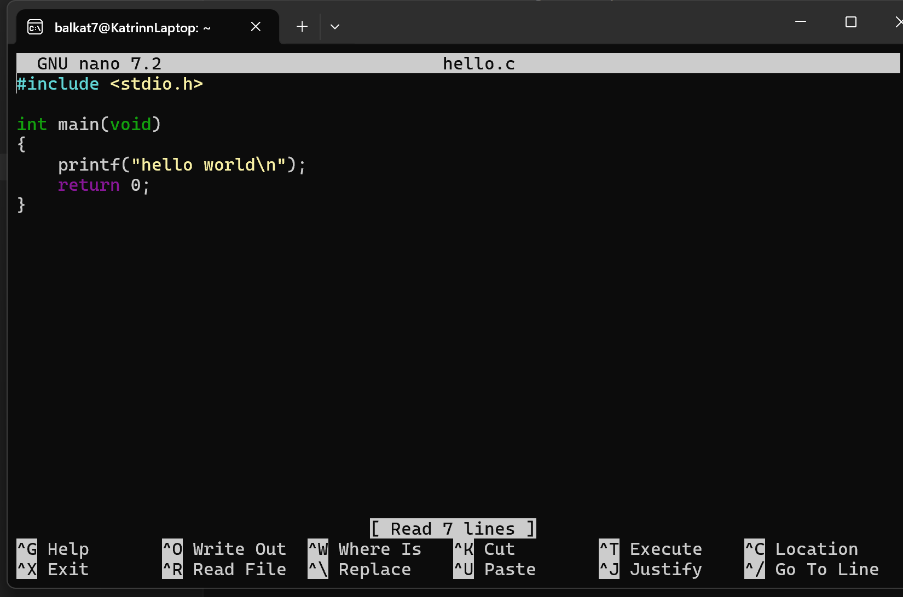

Программа:

```bash
nano program
```

```bash
#!/bin/bash

grep -oE '[A-Za-z_][A-Za-z0-9_]*' "$1" | sort -u | tr '\n' ' '
echo
```

`grep -oE` выводит только совпадения по шаблону идентификатора, `sort -u` сортирует и убирает повторы, `tr '\n' ' '` собирает всё в одну строку.

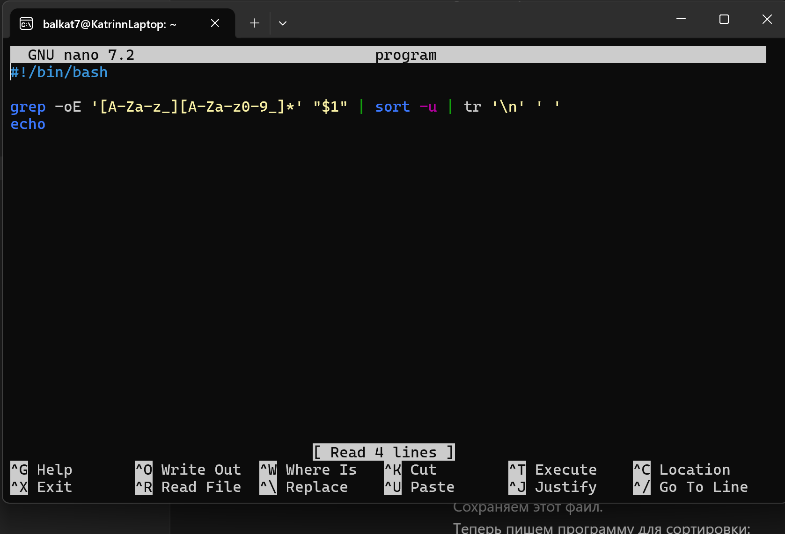

Запуск:

```bash
chmod +x program
./program hello.c
```

**Вывод:**

```
h hello include int main n printf return stdio void world
```

Лишние `h` и `n` — из `stdio.h` и `\n`: скрипт работает с текстом, а не разбирает синтаксис C.

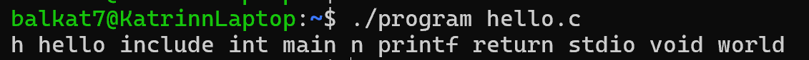

---

## Задание 5

Программа `reg` для регистрации пользовательской команды.

**План:** проверить аргумент - выставить файлу права 755 - скопировать в `/usr/local/bin` (эта папка есть в `PATH`) - показать результат.

```bash
nano reg
```

```bash
#!/bin/bash

if [ $# -ne 1 ]; then
    echo "Использование: $0 <файл-команды>" >&2
    exit 1
fi

file="$1"
name=$(basename "$file")

if [ ! -f "$file" ]; then
    echo "Ошибка: файл '$file' не найден" >&2
    exit 1
fi

chmod 755 "$file"
sudo cp "$file" /usr/local/bin/"$name"
sudo chmod 755 /usr/local/bin/"$name"

echo "Команда '$name' зарегистрирована:"
ls -l /usr/local/bin/"$name"
```

`basename` отбрасывает путь, оставляя имя файла. `sudo` нужен, так как `/usr/local/bin` принадлежит root. Права 755: владельцу всё, остальным чтение и запуск.

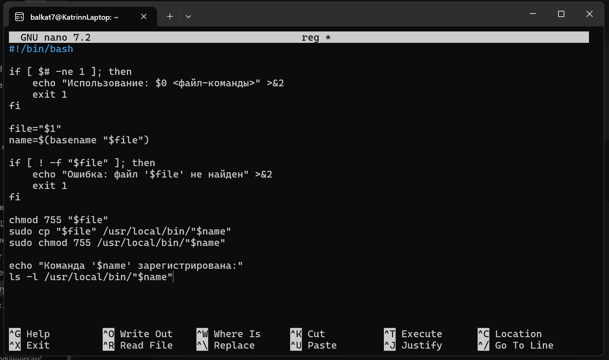

Запуск:

```bash
chmod +x reg
./reg banner
```

**Вывод:**

```
[sudo] password for balkat7:
Команда 'banner' зарегистрирована:
-rwxr-xr-x 1 root root 222 Sep 27 18:15 /usr/local/bin/banner
```

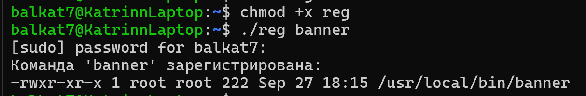

Проверка — вызов из другой директории без `./`:

```bash
which banner
cd /tmp
banner "Hello from RTU MIREA!"
cd ~
```

```
/usr/local/bin/banner
+-----------------------+
| Hello from RTU MIREA! |
+-----------------------+
```

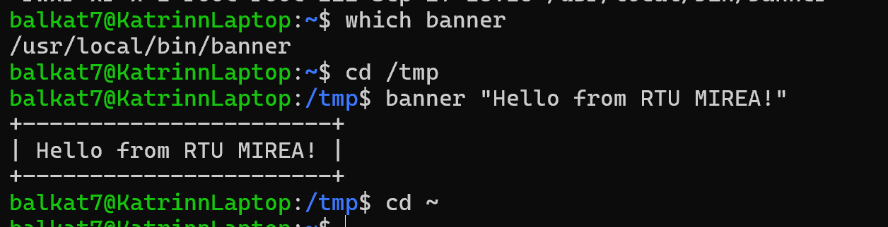

---

## Задание 6

Программа проверки наличия комментария в первой строке файлов `.c`, `.js`, `.py`.

**План:** перебрать переданные файлы - определить расширение - выбрать шаблон комментария (`//` или `/*` для C и JS, `#` для Python) - проверить первую строку.

```bash
nano checkcom
```

```bash
#!/bin/bash

if [ $# -eq 0 ]; then
    echo "Использование: $0 <файл> [файл ...]" >&2
    exit 1
fi

for file in "$@"; do
    if [ ! -f "$file" ]; then
        echo "$file: файл не найден"
        continue
    fi

    ext="${file##*.}"

    case "$ext" in
        c|js) pattern='^[[:space:]]*(//|/\*)' ;;
        py)   pattern='^[[:space:]]*#' ;;
        *)
            echo "$file: расширение .$ext не проверяется"
            continue
            ;;
    esac

    if head -n 1 "$file" | grep -qE "$pattern"; then
        echo "$file: комментарий в первой строке есть"
    else
        echo "$file: комментария в первой строке НЕТ"
    fi
done
```

`${file##*.}` даёт расширение файла, `case` выбирает шаблон по нему, `head -n 1` берёт первую строку, `grep -q` молча возвращает результат проверки для `if`.

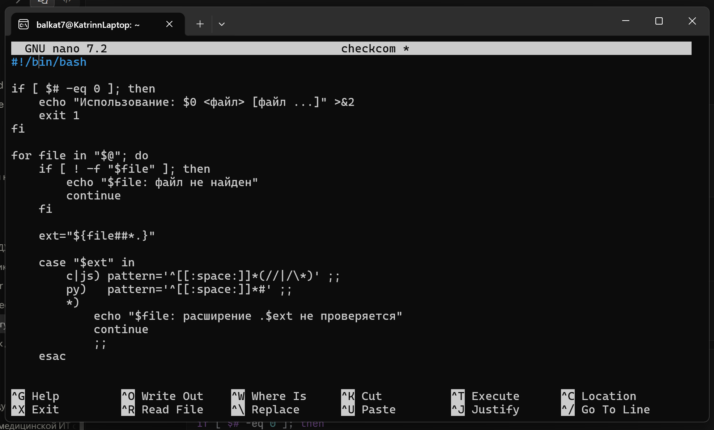

Тестовые файлы — по паре на каждое расширение, с комментарием и без:

```bash
printf '// Программа на C\n#include <stdio.h>\n' > good.c
printf '#include <stdio.h>\nint main(void){return 0;}\n' > bad.c
printf '// скрипт\nconsole.log(1)\n' > good.js
printf 'console.log(1)\n' > bad.js
printf '# скрипт на python\nprint(1)\n' > good.py
printf 'print(1)\n' > bad.py
```

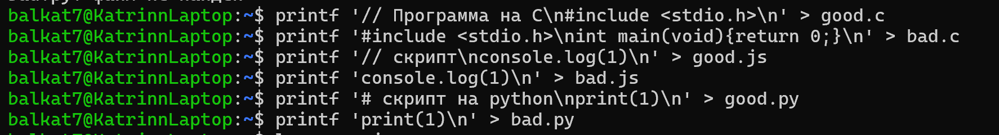

Запуск:

```bash
chmod +x checkcom
./checkcom good.c bad.c good.js bad.js good.py bad.py
```

**Вывод:**

```
good.c: комментарий в первой строке есть
bad.c: комментария в первой строке НЕТ
good.js: комментарий в первой строке есть
bad.js: комментария в первой строке НЕТ
good.py: комментарий в первой строке есть
bad.py: комментария в первой строке НЕТ
```

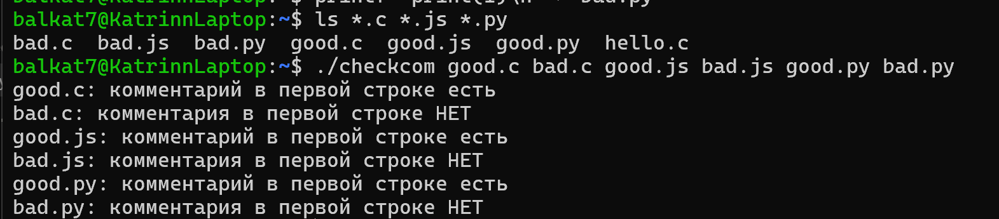

---

## Задание 7

Программа поиска файлов-дубликатов по заданному пути и подкаталогам.

**План:** посчитать хеш каждого файла (одинаковое содержимое — одинаковый хеш) - отсортировать - оставить повторяющиеся хеши - сгруппировать вывод.

```bash
nano finddup
```

```bash
#!/bin/bash

dir="${1:-.}"

if [ ! -d "$dir" ]; then
    echo "Ошибка: каталог '$dir' не найден" >&2
    exit 1
fi

find "$dir" -type f -exec md5sum {} + | sort | uniq -w32 -D | awk '
{
    if ($1 != prev) {
        print ""
        print "Одинаковое содержимое:"
        prev = $1
    }
    print "   " substr($0, 35)
}
'
```

`find -exec md5sum` считает контрольные суммы всех файлов рекурсивно, `uniq -w32 -D` оставляет только строки с повторяющимися хешами (сравниваются первые 32 символа), `awk` печатает группы без самих хешей.

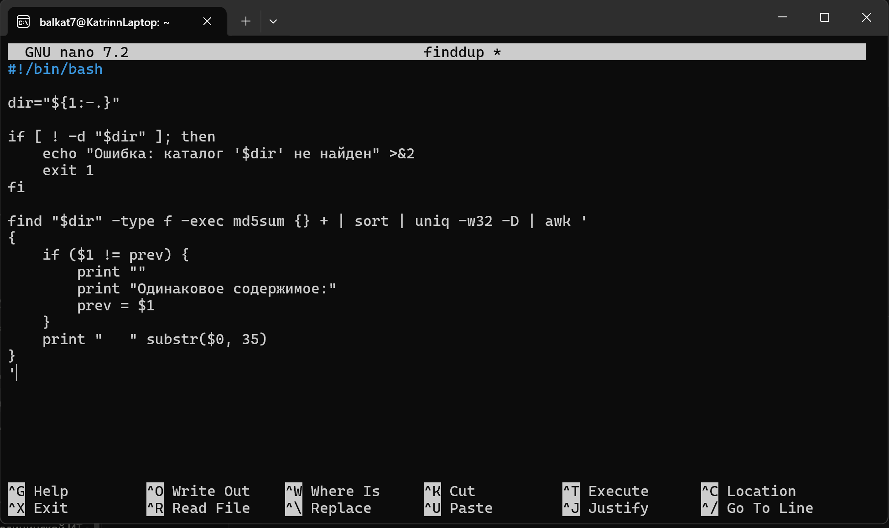

Тестовые данные — три одинаковых файла (один в подкаталоге), два одинаковых и один уникальный:

```bash
mkdir -p testdup/sub
echo "привет" > testdup/a.txt
echo "привет" > testdup/b.txt
echo "привет" > testdup/sub/c.txt
echo "другое" > testdup/d.txt
echo "ещё"    > testdup/sub/e.txt
echo "ещё"    > testdup/sub/f.txt
```

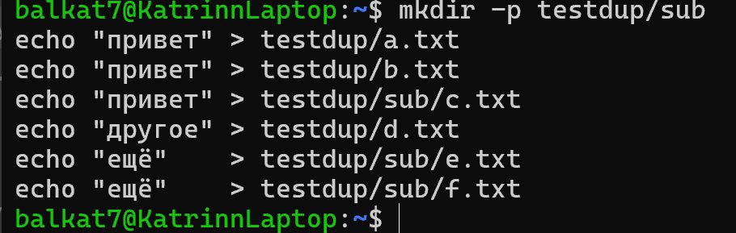

Запуск:

```bash
chmod +x finddup
./finddup testdup
```

**Вывод:**

```
Одинаковое содержимое:
   testdup/sub/e.txt
   testdup/sub/f.txt

Одинаковое содержимое:
   testdup/a.txt
   testdup/b.txt
   testdup/sub/c.txt
```

Уникальный `d.txt` в результат не попал.

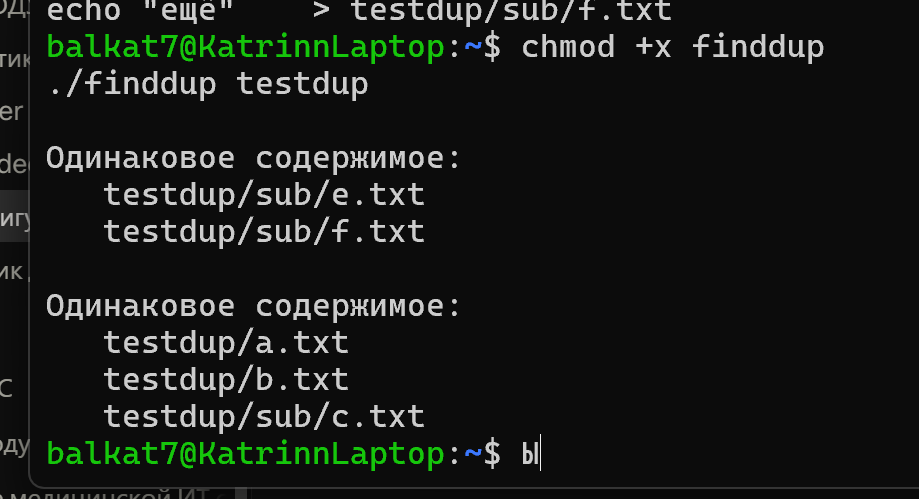

Промежуточный шаг — хеши всех файлов, одинаковые стоят рядом:

```bash
find testdup -type f -exec md5sum {} + | sort
```

```
078a1b8662b2f1a73dbd7a092b098858  testdup/d.txt
180b4a55166f4cb7d18e7b925c77b80b  testdup/sub/e.txt
180b4a55166f4cb7d18e7b925c77b80b  testdup/sub/f.txt
adab637320e5c47624cdd15169276981  testdup/a.txt
adab637320e5c47624cdd15169276981  testdup/b.txt
adab637320e5c47624cdd15169276981  testdup/sub/c.txt
```

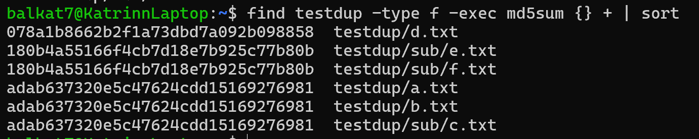

---

## Задание 8

Программа архивации в `tar` всех файлов каталога с заданным расширением.

**План:** проверить аргументы - найти файлы по расширению - посчитать их - передать список в `tar`.

```bash
nano mktar
```

```bash
#!/bin/bash

if [ $# -ne 2 ]; then
    echo "Использование: $0 <каталог> <расширение>" >&2
    exit 1
fi

dir="$1"
ext="$2"
archive="${ext}_files.tar"

if [ ! -d "$dir" ]; then
    echo "Ошибка: каталог '$dir' не найден" >&2
    exit 1
fi

count=$(find "$dir" -type f -name "*.$ext" | wc -l)

if [ "$count" -eq 0 ]; then
    echo "Файлы с расширением .$ext в каталоге '$dir' не найдены"
    exit 1
fi

find "$dir" -type f -name "*.$ext" -print0 | tar -cvf "$archive" --null -T -

echo "Создан архив $archive ($count файлов)"
```

`tar -cvf` создаёт архив, `-T -` читает список файлов со стандартного ввода, пара `-print0` и `--null` корректно обрабатывает имена с пробелами.

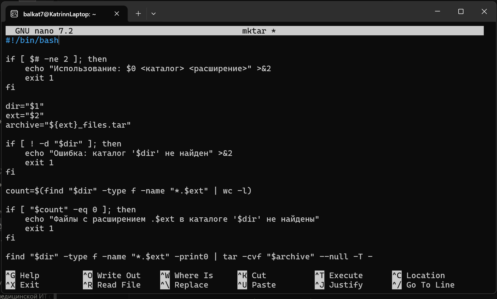

Тестовые данные и запуск:

```bash
mkdir -p data/sub
echo "1" > data/a.txt
echo "2" > data/b.txt
echo "3" > data/sub/c.txt
echo "x" > data/z.log

chmod +x mktar
./mktar data txt
tar -tf txt_files.tar
```

**Вывод:**

```
data/sub/c.txt
data/a.txt
data/b.txt
Создан архив txt_files.tar (3 файлов)
```

`tar -tf` показывает содержимое архива: попали все `.txt`, включая файл из подкаталога, а `z.log` — нет.

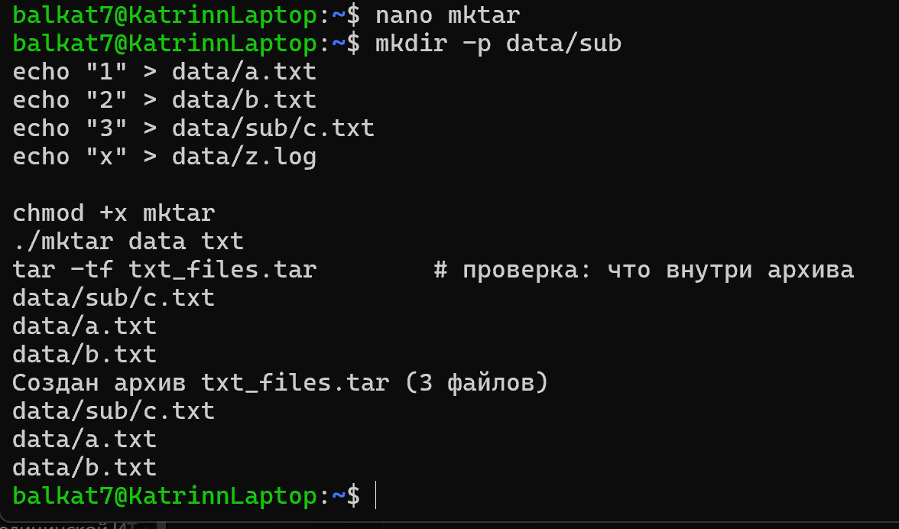

---

## Задание 9

Программа замены последовательностей из 4 пробелов на табуляцию. Входной и выходной файлы — аргументы.

**План:** проверить аргументы - выполнить замену через `sed` - записать результат во второй файл.

```bash
nano sp2tab
```

```bash
#!/bin/bash

if [ $# -ne 2 ]; then
    echo "Использование: $0 <входной-файл> <выходной-файл>" >&2
    exit 1
fi

if [ ! -f "$1" ]; then
    echo "Ошибка: файл '$1' не найден" >&2
    exit 1
fi

sed 's/    /\t/g' "$1" > "$2"

echo "Готово: $1 -> $2"
```

`sed 's/четыре пробела/\t/g'` заменяет все вхождения в строке (`g`), `>` записывает результат в выходной файл, исходный не меняется.

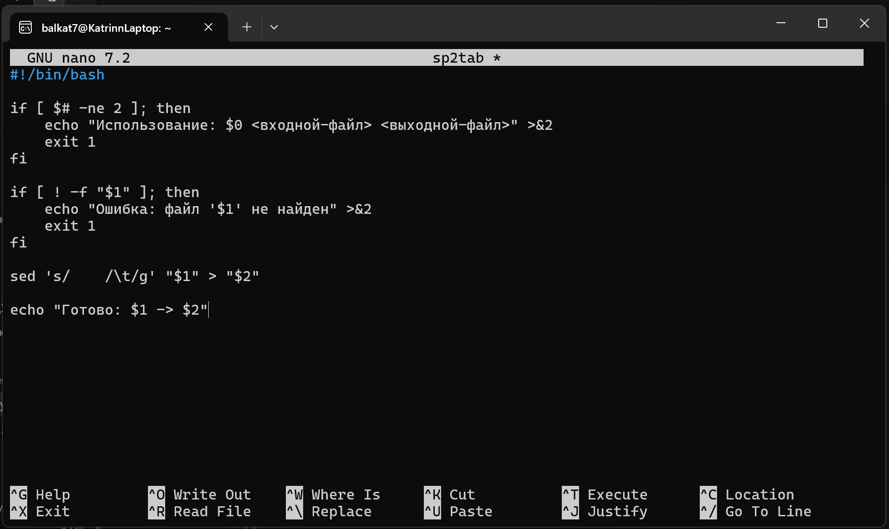

Тестовый файл и запуск:

```bash
printf 'int main(void)\n{\n    printf("hi");\n        return 0;\n}\n' > in.txt
chmod +x sp2tab
./sp2tab in.txt out.txt

cat -A in.txt
cat -A out.txt
```

`cat -A` показывает невидимые символы: `^I` — табуляция, `$` — конец строки.

**Вывод:**

```
было:
int main(void)$
{$
    printf("hi");$
        return 0;$
}$

стало:
int main(void)$
{$
^Iprintf("hi");$
^I^Ireturn 0;$
}$
```

Четыре пробела стали одной табуляцией, восемь — двумя.

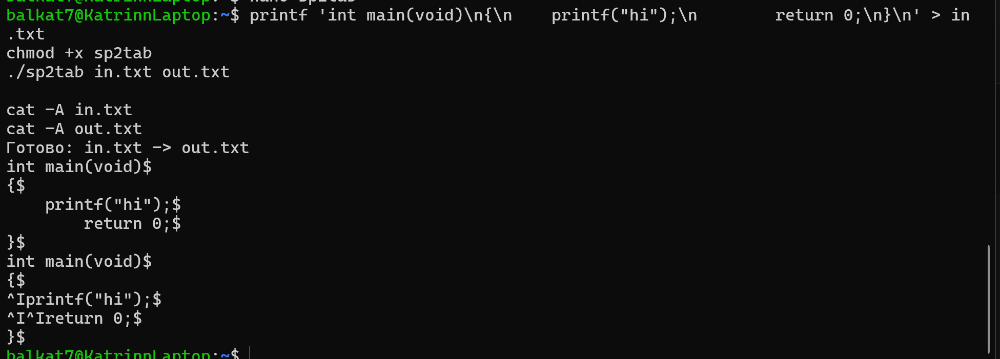

---

## Задание 10

Программа вывода всех пустых текстовых файлов в указанной директории.

**План:** проверить каталог → одной командой `find` отобрать файлы по трём условиям: только в этом каталоге, с расширением `.txt`, пустые.

```bash
nano findempty
```

```bash
#!/bin/bash

dir="${1:-.}"

if [ ! -d "$dir" ]; then
    echo "Ошибка: каталог '$dir' не найден" >&2
    exit 1
fi

find "$dir" -maxdepth 1 -type f -name "*.txt" -empty
```

`-maxdepth 1` не пускает поиск в подкаталоги, `-name "*.txt"` отбирает текстовые файлы, `-empty` — файлы нулевого размера. Условия объединяются по «и».

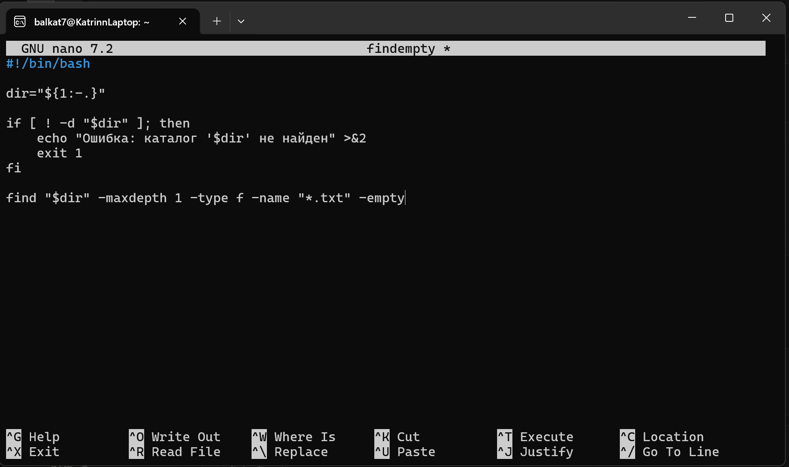

Тестовые данные и запуск:

```bash
mkdir -p empt
: > empt/e1.txt
: > empt/e2.txt
echo "текст" > empt/full.txt
: > empt/notes.log

chmod +x findempty
./findempty empt
```

`: > файл` создаёт пустой файл.

**Вывод:**

```
empt/e2.txt
empt/e1.txt
```

Непустой `full.txt` и пустой, но не текстовый `notes.log` не попали в результат.

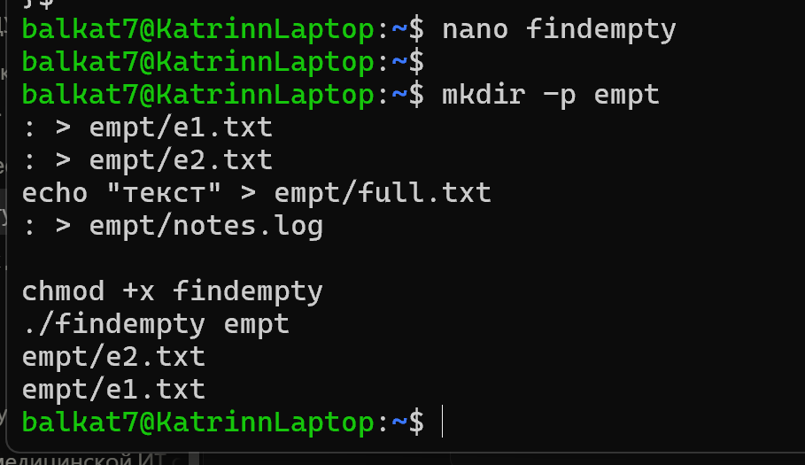
